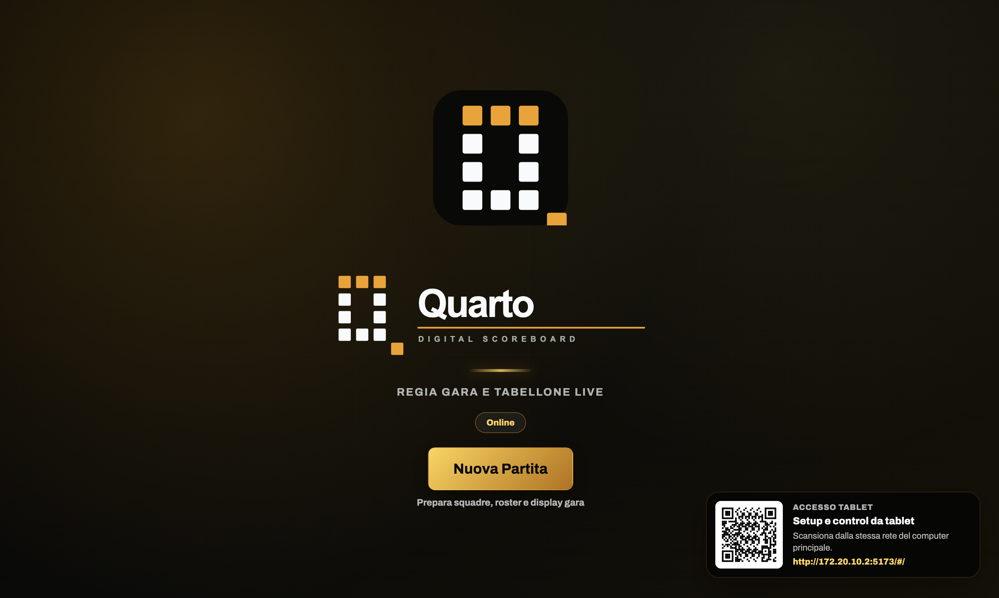
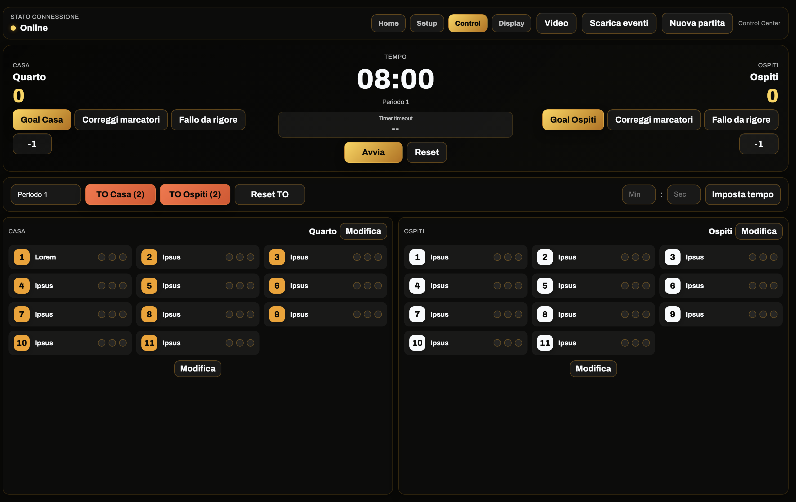
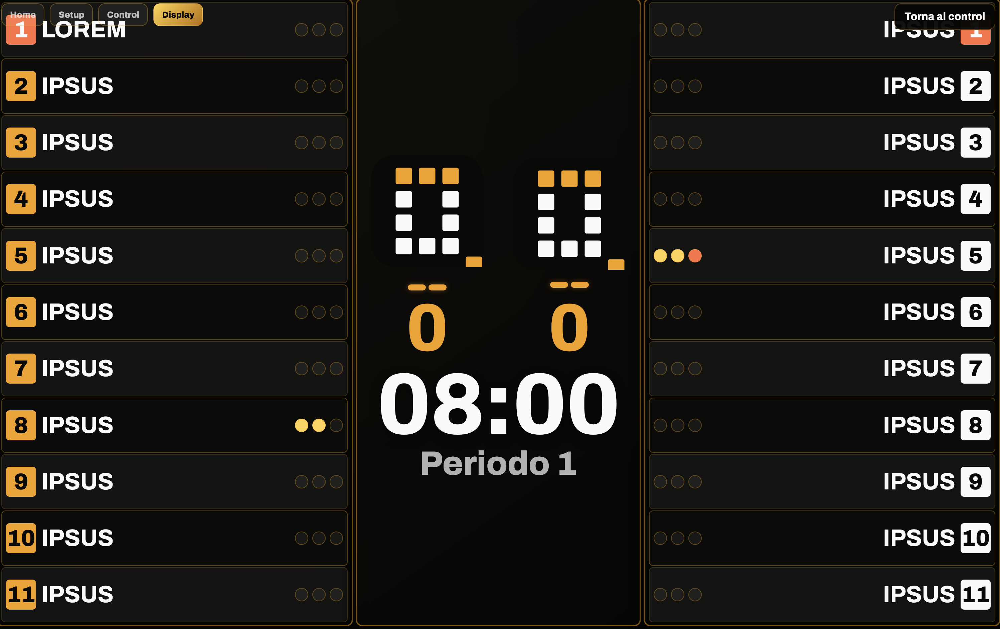
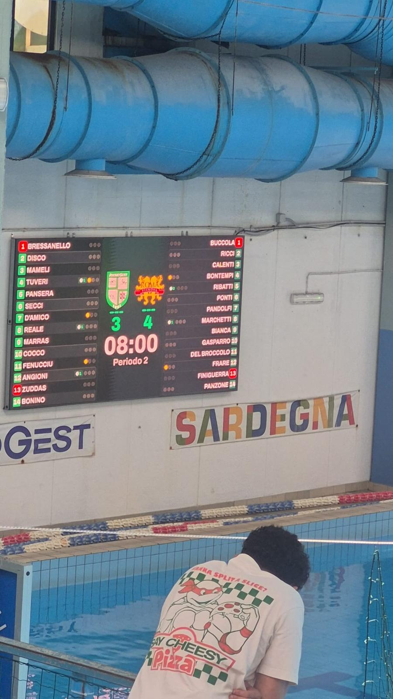
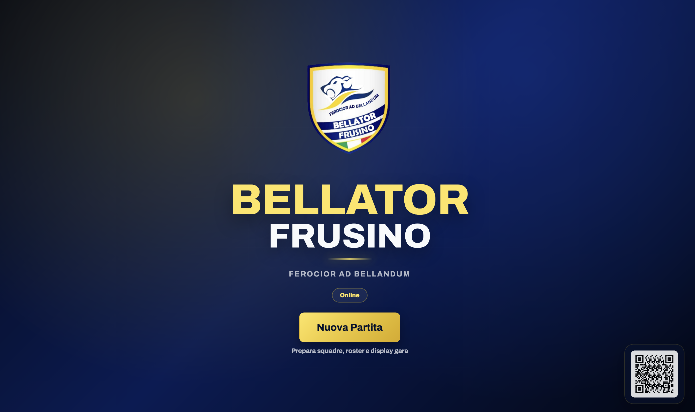
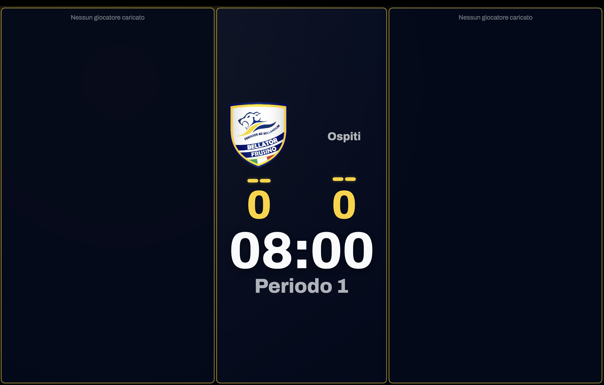
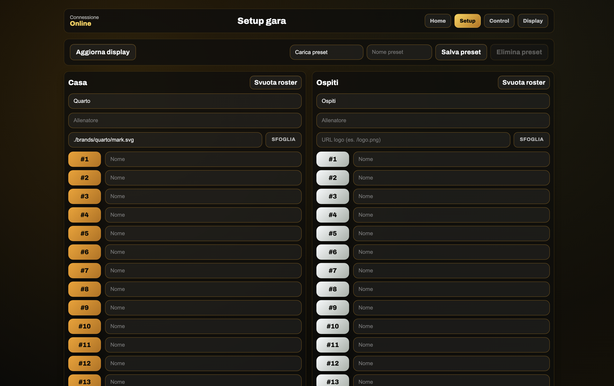
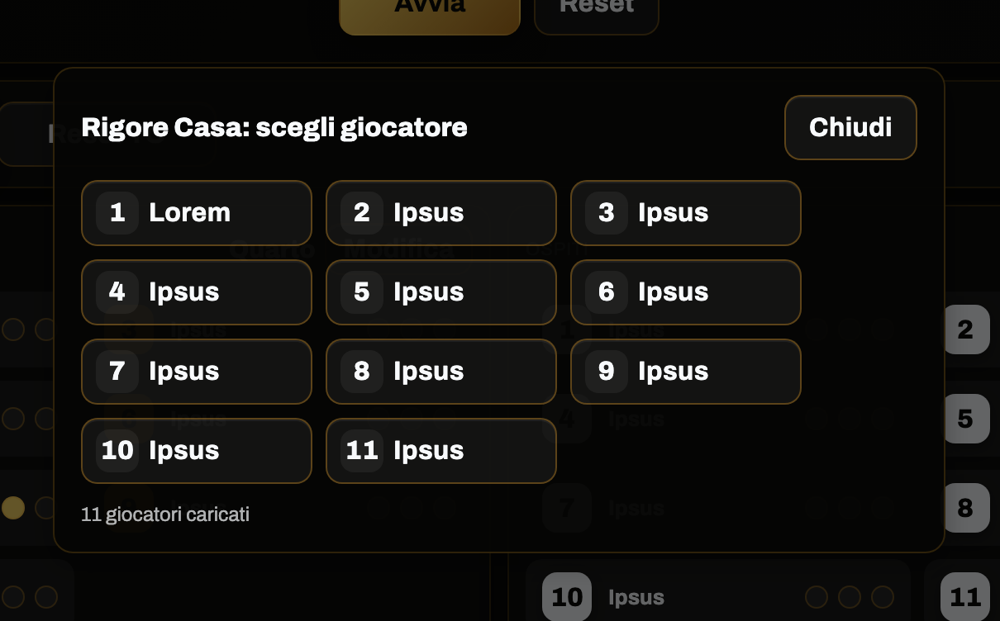
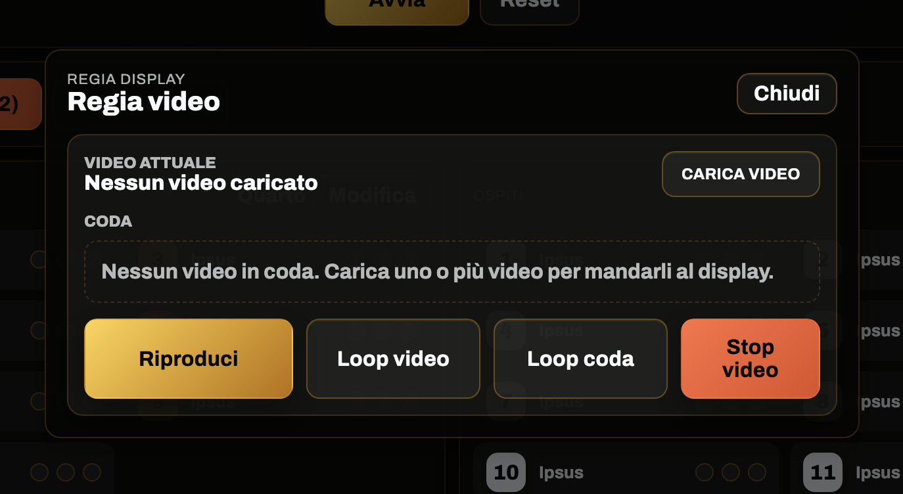

# Quarto

**Regia gara, tabellone live e display personalizzato per la pallanuoto.**

Quarto è un sistema desktop pensato per gestire una partita dal tavolo giuria e proiettare in tempo reale punteggio, cronometro, roster, timeout, espulsioni e contenuti video su ledwall, TV, proiettore o secondo schermo.

È nato per l’uso durante eventi reali: deve essere rapido per chi lo controlla, leggibile per chi guarda e affidabile anche senza connessione internet.

  

## Dal tavolo giuria al ledwall

Quarto separa il lavoro dell’operatore dalla visualizzazione pubblica. Sul computer principale si gestisce la gara; sul display esterno viene mostrato un tabellone pulito, leggibile e pronto per il pubblico.

  

Con un unico pannello si possono controllare le azioni principali della partita:

- punteggio, periodo e cronometro;
- goal e correzione marcatori;
- timeout;
- rigori ed espulsioni;
- roster, numeri e nomi giocatori;
- eventi e report di fine gara;
- contenuti video da mandare al display.

## Display live

Il display è progettato per essere visto da lontano: punteggi grandi, timer centrale, periodo evidente, roster laterali e indicatori sullo stato dei giocatori.

  

Può essere usato su ledwall, TV, proiettore o monitor secondario, lasciando il computer principale libero per la gestione operativa.

  

  <em>Quarto in uso su ledwall durante una partita, con grafica personalizzata per squadra ed evento.</em>

## Personalizzazione per club ed eventi

Quarto può essere adattato all’identità visiva di una società sportiva o di un evento. Colori, loghi, schermata iniziale, display e asset grafici possono essere personalizzati per rendere il tabellone coerente con il brand della squadra.

  

  

Questa impostazione permette di usare lo stesso prodotto in contesti diversi: tornei, partite ufficiali, eventi societari, presentazioni squadra e giornate speciali.

## Setup rapido prima della gara

Prima dell’inizio è possibile preparare squadre, loghi, allenatori, roster e preset riutilizzabili. L’obiettivo è ridurre il tempo di configurazione e rendere più semplice lavorare con partite diverse durante la stagione.

  

## Pensato per l’operatore

Durante una partita ogni azione deve essere immediata. Quarto è pensato per ridurre i passaggi nelle operazioni più frequenti: goal, correzioni, rigori, espulsioni, timeout, cambio periodo e avvio o pausa del tempo.

  

## Regia video integrata

Oltre al tabellone, Quarto include una regia display per gestire contenuti video durante l’evento. È possibile caricare clip, preparare una coda, riprodurre contenuti sul display e usare loop video o loop playlist.

  

Questo permette di usare lo stesso sistema sia per la gestione sportiva sia per la presentazione visiva della partita.

## Offline-first

Quarto è progettato per funzionare anche senza connessione internet. In un evento live questo è fondamentale: il sistema deve continuare a lavorare anche quando la rete esterna non è disponibile.

- Stato gara sincronizzato in tempo reale sulla rete locale.
- Display aggiornato a bassa latenza.
- Applicazione desktop con supporto a secondo schermo.
- Licenza gestibile anche in modalità offline.
- Accesso da tablet sulla stessa rete locale tramite QR code.

## Utilizzo reale

Quarto è stato utilizzato in partite ufficiali FIN Serie C. Il progetto nasce quindi da un’esigenza concreta: avere un sistema semplice da usare in gara, ma abbastanza flessibile da gestire display, roster, loghi, personalizzazioni e contenuti visuali.

## Screenshots

| Home | Control center |
| --- | --- |
|  |  |

| Display live | Ledwall reale |
| --- | --- |
|  |  |

| Personalizzazione club | Display personalizzato |
| --- | --- |
|  |  |

| Setup gara | Regia video |
| --- | --- |
|  |  |

## Stato del progetto

Il progetto è in sviluppo attivo. Questa repository pubblica presenta il prodotto e le sue funzionalità principali; il codice sorgente completo resta privato.

---

**Quarto** - scoreboard, match management e regia visuale personalizzabile per la pallanuoto.
